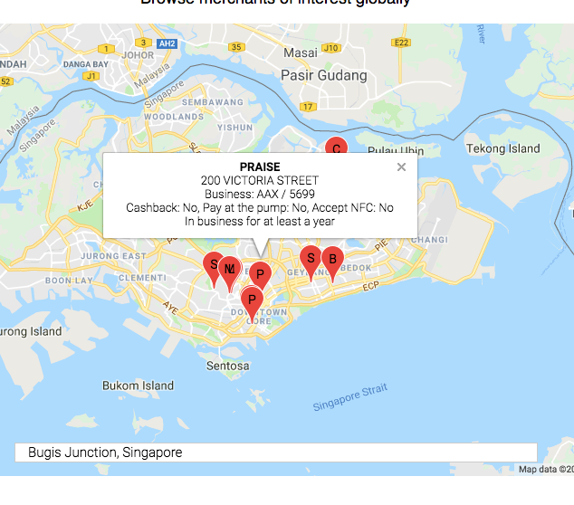

# MERCHANT-OF-INTEREST Progressive Web App (PWA)

## 1. Overview
### What we will build
* An PWA that let its user search a location and view merchants of interest around that location
    

* A user can enter his/her query in a small box at the map's bottom center. The map automatically navigates to the searched location and displays all merchants of interest surround the location. 

* Each merchant is denoted by a marker which displays the merchant's name, address, features (cashback, pay-at-the-pump, nfc) and business history when clicked or tapped on

### What we will learn
* An example of combining Mastercard Places API with Google Map API

* Detailed information about several Places APIs ([Merchant Point of Interest](https://developer.mastercard.com/documentation/places/#api_merchant_point_of_interest), [Merchant Category Codes](https://developer.mastercard.com/documentation/places/#api_merchant_category_codes), [Merchant Industries](https://developer.mastercard.com/documentation/places/#api_merchant_industries)) including their input requirements, output formats, what they do and how they relate to each other
   

### What you will need
* A PCKS#12 certificate (.p12) and a consumer key of a Mastercard API project that uses Places API.  See [Creating a project on Mastercard Developers](https://developer.mastercard.com/tutorial/creating-a-project-on-mastercard-developers) if you have not one

* A Google map API key. Get one [here]( https://cloud.google.com/maps-platform/)

* [NodeJS](https://nodejs.org/en/)

* Basic understanding of React framework (or not, if you're willing to read simple react codes)

### Our implementation plan
* Create a PWA that works with mock data

* Write backend code to call Masterard Places APIs and send their responses back to the app
    > For security reason, Mastercard requires all API communication to be authenticated with pre-registered credentials that includes a PCKS#12 certificate (.p12) and a consumer key. These credentials must be securely stored and accessed, and must not reside in or are directly accessible from all frontend media such as mobile app or browser. For this reason, we need a backend server that stores and uses Mastercard API credentials to call Mastercard Places APIs and returns their responses to frontend codes in the PWA

* Integrate frontend and backend codes

Check out this tutorial's codes at https://github.com/Mastercard/location-tutorial-merchant-of-interest-pwa-app to follow the tutorial more effectively

## 2. Create a PWA Merchant-of-Interest app
### The setting up:
* Create a skeleton app with [create-react-app](https://github.com/facebook/create-react-app)
* Update the app's name and icon's size in `public/manifest.json` and `public/index.html`
* Setup app's layout consisting of 3 sections (icon/title, description, map) in `src/App.js` and `src/App.css`
    
### The Map component (`src/Map.css`, `src/Map.js`)
* At this stage in our implementation, `Map.js` uses mock data instead of making real API requests. Let's store a sample response from the [API documentation](https://developer.mastercard.com/documentation/places/#api_merchant_point_of_interest) into `sample-moi.json` then import it into `Map.js`. 
    

* When the app inquires for merchants of interest around a location, we'll just return the mock data
    ```javascript
    import moi from './sample-moi.json'
    /* ... */
    queryMerchants(pos) {
        if (process.env.NODE_ENV !== "production") {
            return Promise.resolve(moi);
        }
        else {
            alert ("To do!!!");
        }
    }
    ```

    > **Note**: `queryMerchant` is returning a [Promise](https://developers.google.com/web/fundamentals/primers/promises) object as we will have to make asynchronous call to backend API later on
    > 
    > ```
    > return Promise.resolve(moi);
    > ...
    > window.queryMerchants(location)
    >             .then(moiQueryResp => {
    > ```

* For each merchant found (i.e. each `place` element in API response), we'll need information such as name, address, features (cashback, pay-at-the-pump, nfc) and business history
    ```javascript
    extractPlaceDetails(place) {
        function isTrue(value) {
            return value.toLowerCase() === "true" 
        }
        function hasFeature(feature, featureName) {
            return featureName + ": " + (isTrue(feature) ? "Yes" : "No")
        }

        function history(place) {
            return isTrue(place.newBusinessFlag) ? "New business"
            : isTrue(place.inBusiness360DayFlag) ? "In business for at least a year"
            : isTrue(place.inBusiness180DayFlag) ? "In business for at least 6 months"
            : isTrue(place.inBusiness90DayFlag) ? "In business for at least 90 days"
            : isTrue(place.inBusiness60DayFlag) ? "In business for at least 60 days"
            : isTrue(place.inBusiness30DayFlag) ? "In business for at least 30 days"
            : isTrue(place.inBusiness7DayFlag) ? "In business for at least 7 days"
            : "";
        }
        return {
            "place-name": place.cleansedMerchantName,
            "place-address": place.cleansedStreetAddr,
            "place-classification": "Business: " + place.industry + " / " + place.mccCode,
            "place-features": hasFeature(place.cashBack, "Cashback")
                + ", " + hasFeature(place.payAtThePump, "Pay at the pump")
                + ", " + hasFeature(place.nfcFlag, "Accept NFC"),
            "place-history": history(place)
        }
    }
    ```

* The rest of `Map.js` renders Google map, search location, plant markers for found merchants and displays merchant information when clicked (or tapped)
    > **Tips**: 
    > * Use `google.maps.Geocoder` to obtain country code of the location return by `navigator.geolocation.getCurrentPosition(...)`. Country code is a mandatory input when calling [Merchant Point of Interest](https://developer.mastercard.com/documentation/places/#api_merchant_point_of_interest). 
    >* Use `google.maps.LatLngBounds` to track the span area of merchants so that we can adjust the map's bound and zoom level to fit all merchants in a view

* Test our PWA app
    ```
    npm start
    ```
    


## 3. Write backend code to call Mastercard Places API
### Recall: Why we need a backend?
For security reason, Mastercard requires all API communication to be authenticated with pre-registered credentials that includes a PCKS#12 certificate (.p12) and a consumer key. These credentials must be securely stored and accessed, and must not reside in or are directly accessible from all frontend media such as mobile app or browser. For this reason, we need a backend server that stores and uses Mastercard API credentials to call Mastercard Places APIs and returns their responses to frontend codes in the PWA

### The setting up
* Create a folder `backend` to house the API code which we'll adapt from the earlier [Getting Started tutorial](https://developer.mastercard.com/tutorial/locations-and-places-api-getting-started)
* Install Express JS, its dependencies and Mastercard SDK for Places API
* Create a `backend/server.js` to setup NodeJS/Express instance. The codes are adapted from last tutorial's `app.js` and `bin\www` with unused routes (index, users and locations) removed
* Create a `backend/config/credentials.js` to store Mastercard API credentials

### The API code
* Create a `backend/routes/places.js` to house codes that calls Mastercard Places API. We will extend the previous tutorial's `places.js` to calls Places' [Merchant Point of Interest](https://developer.mastercard.com/documentation/places/#api_merchant_point_of_interest), [Merchant Category Codes](https://developer.mastercard.com/documentation/places/#api_merchant_category_codes), [Merchant Industries](https://developer.mastercard.com/documentation/places/#api_merchant_industries) APIs

    ```javascript
    /* Routes */
    router.get('/merchantPOI', getMerchantPOI);
    router.get('/merchantCategoryCodes', getMerchantCategoryCodes);
    router.get('/merchantIndustries', getMerchantIndustries);

    /* implementation */
    function getMerchantPOI(req, res, next){
        /* ... */
    }

    function getMerchantCategoryCodes(req, res, next){
        /* ... */
    }

    function getMerchantIndustries(req, res, next){
        /* ... */
    }
    ```

* Start a server and visit http://localhost:3000/places/merchantindustries to verify our implementation works
    ``` 
    node backend/server.js
    ``` 
    

## 4. Integrate frontend and backend code
* Merge frontend and backend builds: Modify `build` task inside  `package.json`
    ```json
    "build": "react-scripts build; echo 'Copy backend codes'; cp -r backend build;",
    ```

* Write static routes that serve frontend files: Modify `backend/server.js`
    ```javascript
    app.use('/static', express.static(path.join(__dirname, '/../static')));

    app.get('/', function(req, res) {
        res.sendFile(path.join(__dirname, '/../index.html'));
    });

    app.get('/service-worker.js', function(req, res) {
        res.sendFile(path.join(__dirname, '/../service-worker.js'));
    });
    ```
    
* If we run our app now, we'll be able to access both backend (http://localhost:3000/places/merchantindustries) and frontend (http://localhost:3000/) with a to-do catch
    ```
    npm run build
    node build/backend/server.js
    ```
    

* Update `src\Map.js` to actually fetch data from the backend in production build
    ```java
    queryMerchants(pos) {
        var lat = pos.lat;
        var lng = pos.lng;
        var countryCode = pos.countryCode;

        if (process.env.NODE_ENV !== "production") {
            return Promise.resolve(moi);
        }
        else {
            /* Fetch data from server */
            return fetch(`${process.env.PUBLIC_URL}/places/merchantPOI?lat=${lat}&lng=${lng}&countryCode=${countryCode}`)
                .then(response => {
                    if (response.status !== 200) {
                        console.log('Server error - Status Code: ' + response.status);
                        return Promise.reject(new Error("Http error: " + response.status));
                    }
                    return Promise.resolve(response.json());
                })
                .catch(err => {
                    console.log("Fetch error: " + err);
                    return Promise.reject(err);
                });
        }
    }
    ```

* Update `backend/routes/places.js` to send latitude, longitude and country code parameters and `"radiusSearch": "true"` to [Merchant Point of Interest](https://developer.mastercard.com/documentation/places/#api_merchant_point_of_interest) API. 
    > **Tip**: The [Merchant Point of Interest](https://developer.mastercard.com/documentation/places/#api_merchant_point_of_interest) API appears to support both 2-letter country code and 3-letter country code

    ```javascript
    function getMerchantPOI(req, res, next){
        init();
        
        var requestData = {
            "pageOffset": "0",
            "pageLength": "10",
            "radiusSearch": "true",
            "unit": "km",
            "distance": "15",
            "place": {
                "countryCode": req.query.countryCode,          
                "latitude": req.query.lat,
                "longitude": req.query.lng
            }
        };

        places.MerchantPointOfInterest.create(requestData
        , function (error, data) {
            if (error) {
                res.status = 500;
                res.send(error);
                console.log("Error: " + JSON.stringify(error));
            }
            else {
                res.send(data);
                console.log("Success: " + JSON.stringify(data));
            }
        });
    }
    ```

* Let's re-test our implementation. Here's a sample search for Bugis Junction, Singapore
    ```
    npm run build
    node build/backend/server.js
    ```
    


## 5. Showing merchant's industry and category
* Inside a merchant's information panel (below image), *"Business: AAF / 5691"* represents the merchant's industry and mastercard category in encoded form. To show industry and category's names instead of codes, we'll need [Merchant Industries](https://developer.mastercard.com/documentation/places/#api_merchant_industries) and [Merchant Category Codes](https://developer.mastercard.com/documentation/places/#api_merchant_category_codes) APIs 
    

* Firstly, let's retrieve and cache lists of industry codes and merchant category codes in our app. Modify `src\Map.js` to add a constructor
    ```javascript
    constructor(props) {
        super(props)

        fetch(`${process.env.PUBLIC_URL}/places/merchantIndustries`)
            .then(resp => resp.json())
            .then(json => {
                window.industries = json.MerchantIndustryList.MerchantIndustryArray.MerchantIndustry;
            });

        fetch(`${process.env.PUBLIC_URL}/places/merchantCategoryCodes`)
            .then(resp => resp.json())    
            .then(json => {
                window.categories = json.MerchantCategoryCodeList.MerchantCategoryCodeArray.MerchantCategoryCode;
            });
    }
    ```
    > **Note**: You should explore alternative browser storage solutions instead of this oversimplied `window` properties trick

* Update function `extractPlaceDetails` to convert industry and category codes to friendlier names
    ```javascript
    var industry = window.industries.find(industry => industry.Industry ===  place.industry) 
                    || {IndustryName: place.industry};
    industry = industry.IndustryName ;

    var category = window.categories.find(cat => cat.MerchantCatCode ===  place.mccCode) 
                    || {MerchantCategoryName: place.mccCode};
    category = category.MerchantCategoryName;

    return {
        "place-name": place.cleansedMerchantName,
        "place-address": place.cleansedStreetAddr,
        "place-classification": "Business: " + industry + " / " + category,
        "place-features": hasFeature(place.cashBack, "Cashback")
            + ", " + hasFeature(place.payAtThePump, "Pay at the pump")
            + ", " + hasFeature(place.nfcFlag, "Accept NFC"),
        "place-history": history(place)
    }
    ```
    > **Note**: In Sandbox environment, the industry and category lists obtained from [Merchant Industries](https://developer.mastercard.com/documentation/places/#api_merchant_industries) and [Merchant Category Codes](https://developer.mastercard.com/documentation/places/#api_merchant_category_codes) APIs are not extensive. If `find` found no matching industry/category, we display the code

* Let's retest our implementation. Here's a same search for Bugis Junction, Singapore
    ```
    npm run build
    node build/backend/server.js
    ```
    


## 6. Summary
We have built a simple PWA that integrates the popular Google Map with several Mastercard Places APIs. 

We have looked at [Merchant Point of Interest](https://developer.mastercard.com/documentation/places/#api_merchant_point_of_interest), [Merchant Category Codes](https://developer.mastercard.com/documentation/places/#api_merchant_category_codes), [Merchant Industries](https://developer.mastercard.com/documentation/places/#api_merchant_industries) in details (including their inputs, outputs, what they do) and how they relate to each other

> We didn't cover [Place by Location Id](https://developer.mastercard.com/documentation/places/1#api_place_by_location_id) but if you want to quickly retrieve detailed information of a merchant knowing its `locationId` (as seen in [Merchant Point of Interest](https://developer.mastercard.com/documentation/places/#api_merchant_point_of_interest)'s response), it's your go-to API

There are areas for improvement such as better caching mechanism for category and industry codes and names, displaying more merchant information (e.g. contact,  primary distribution channels). They are left as exercises for interested readers.

## 7. See also
Consuming Mastercard Places API are easy. But if you need assistance, here are some useful links:
* [Places API documentation & FAQ](https://developer.mastercard.com/documentation/places/#overview)
* [Locations and Places API - Getting Started](https://to.update.link)
* [API Support](https://developer.mastercard.com/support)

Below are useful resources from which this tutorial borrows ideas and inspiration
* https://medium.com/front-end-hacking/build-a-realtime-pwa-with-react-99e7b0fd3270
* https://developers.google.com/maps/documentation/javascript/examples


